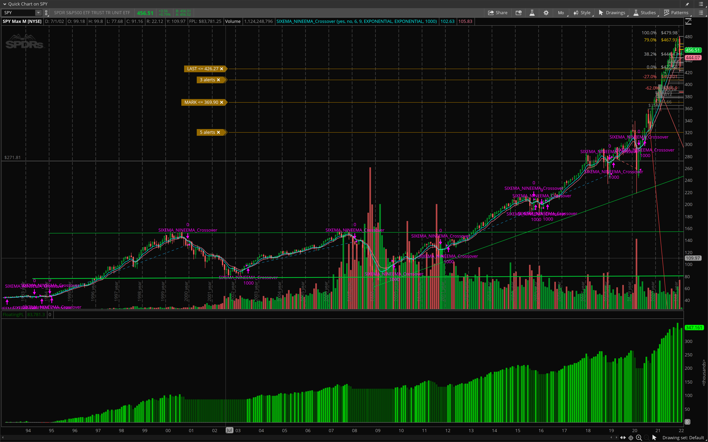

# SWING TRADE 69
This is a reiteration of swing trade signals i originally applied to SPY and QQQ, now adding these same paramters into ThinkScipt to backtest and eventually automate the process to become a long term personal portfolio management strategy.

THIS IS NOT INVESTMENT ADVICE AND SHOULD NOT BE USED IN ANY WAY, SHAPE, OR FORM AS A TRADING SIGNAL, OR BUY/SELL RECOMMENDATION WITH REAL MONEY. I CREATED THIS TO DETERMINE IF THE STRATEGY IS VIABLE MOVING FORWARD GIVEN THE EVOLVED MARKET CONDITIONS.

This visualization shows the script at work on the monthly timeframe since SPY's inception.

## The following steps will be performed in this project
1. Create a THINK OR SWIM ACCOUNT WITH TD AMERITRADE
2. EDIT STUDIES

